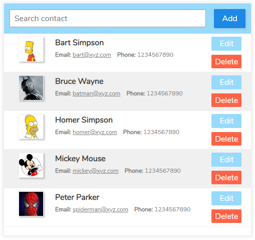

# Contact List application
The contact list application is written in [React](https://reactjs.org/) and [Redux](https://redux.js.org/) (for demonstration purpose only).

The application is located on [my portfolio website](https://daisukenakano.com/index.php#spa)

The source codes are located in the **src/** directory:
* **src/ContactListApp/** - Contains source files used to create the contact list application.
  * **index.jsx** - Entry point of the application: Creates Redux store and mounts the application to DOM.
  * **actions/** - Contains files that defines and creates Redux action types and action creators.
  * **assets/** - Contains image and sample data files used to populate the list.
  * **components/** - React components written in JSX that create the application.
  * **reducers/** - Contains files that create Redux reducers.
  * **stylesheets/** - Sass stylesheet to style the application.
* **src/components/** - Generic components (i.e. error message popup, dialog popup, etc.) used in the application.
* **src/stylesheets/** - Sass stylesheet used globally amongst all applications.
* **src/utils/** - Utility functions written in JavaScript used globally amongst all applications.

Technologies used: **Babel, ESLint, JavaScript (ES6+), JSX, PostCSS, React, Redux, Sass, stylelint, webpack**

If you have any questions or comments, please contact me. Thanks for looking!
